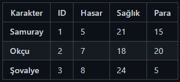
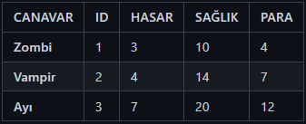
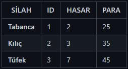
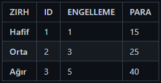

# PATİKA DEV 
### JAVA 102
### *ADVENTURE GAME*

*************
### * CHARS

### * MONSTERS 

### * WEAPONS 

### * ARMORS

*****************

### DIAGRAM

### * Güvenli Ev

    Özellik : Can Yenileniyor

### * Mağara

    Canavar : Zombi (1-3 Adet)
    Özellik : Savaş + Ganimet
    Eşya : Yemek (Food)

### * Orman

    Canavar : Vampir (1-3 Adet)
    Özellik : Savaş + Ganimet
    Eşya : Odun (Firewood)

### * Nehir

    Canavar : Ayı (1-3 Adet)
    Özellik : Savaş + Ganimet
    Eşya : Su (Water)

### * Mağaza

    Özellik : Destekleyici Eşyalar Satın Almak
    Silah : Tabanca,Kılıç,Tüfek
    Zırh : Hafif,Orta,Ağır
